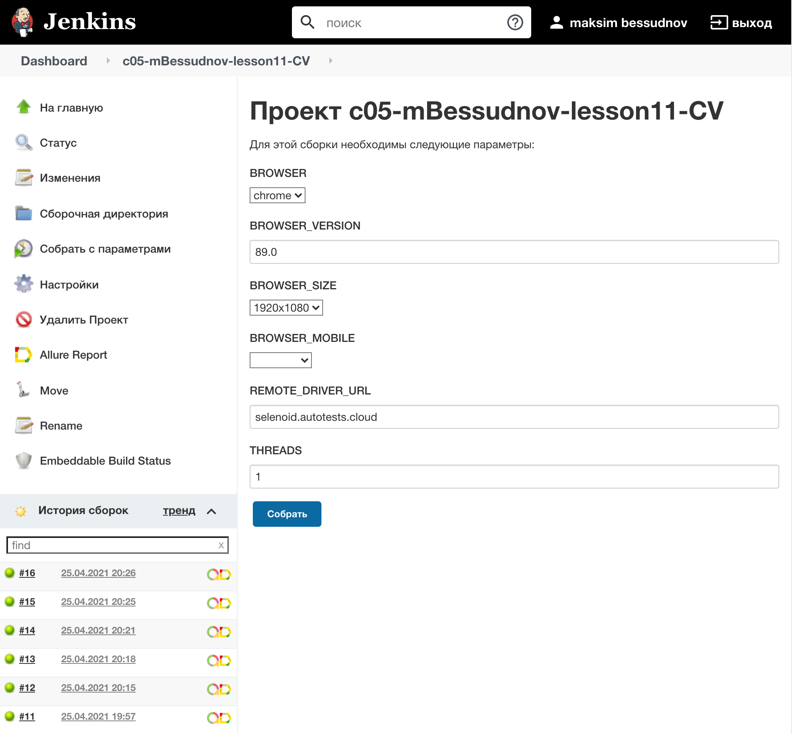
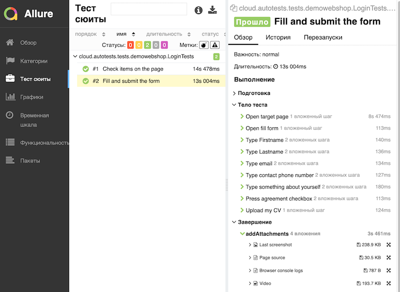
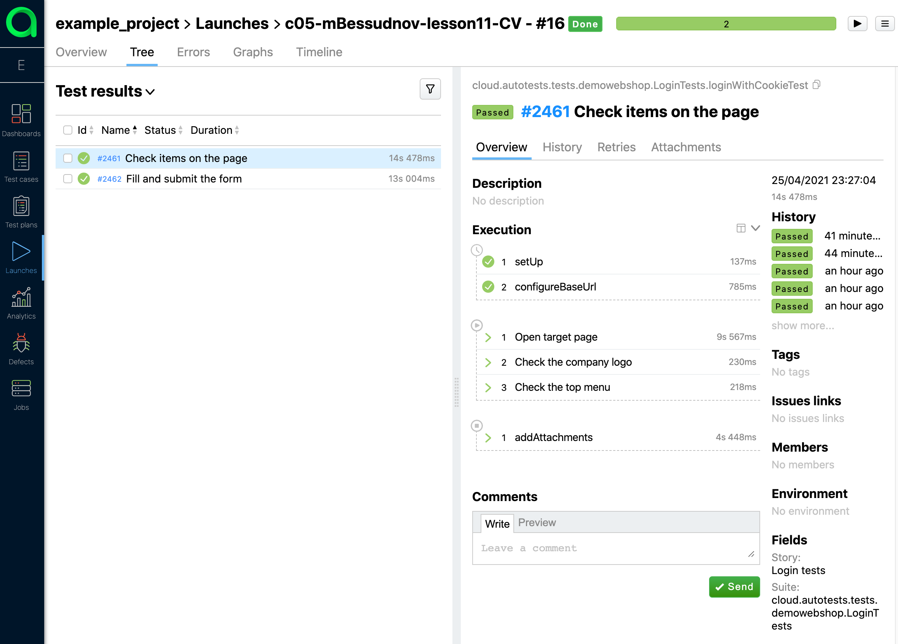
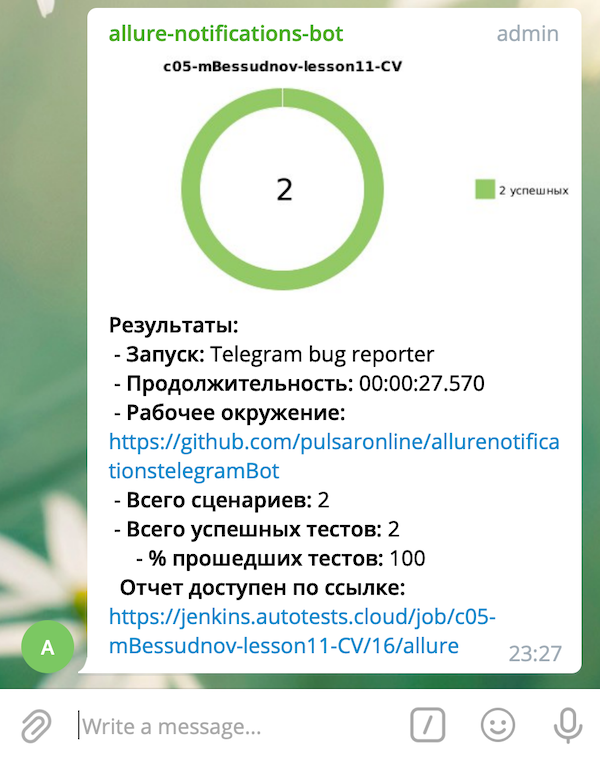

# Выборочный автотест ресурса Playrix.ru
https://playrix.ru

# Использованы технологии:

- IDE IntelliJ Idea
- Java, Gradle
- Junit5, Selenide
- Allure
- Jenkins
- Selenoid
- Telegram Bot

# Описание сборки:
Тестируются UI элементы веб страницы.

- Автоматизирован запуск тестов из Jenkins
- Для кросс-браузерного тестирования использован Selenoid
- Отчет о пройденных тестах генерируется Allure, добавляются логи,скриншоты браузера, видео прохождения тестов
- Отправляется отчет тест-сессии в Telegram

## Отчеты Allure reports
### Jenkins сборка

### Отчет о прохождении тест сьюта в Allure Report

### Отчет о прохождении тест сьюта в Allure TestOps

### Видео прохождения одного из тестов

## Уведомление в Telegram

## Ссылки
### Jenkins job
https://jenkins.autotests.cloud/job/c05-mBessudnov-lesson11-CV/16/
### Allure reports
https://jenkins.autotests.cloud/job/c05-mBessudnov-lesson11-CV/16/allure/
